# VisitedPlaces

**A personal atlas for where you have been and where you want to go.** Mark countries and sub-regions, see your travel coverage, and compare maps with friends using share codes. Your places stay in your browser; no account is required.

[](package.json) [](LICENSE) [](https://github.com/NotToxel/VisitedPlaces/actions)

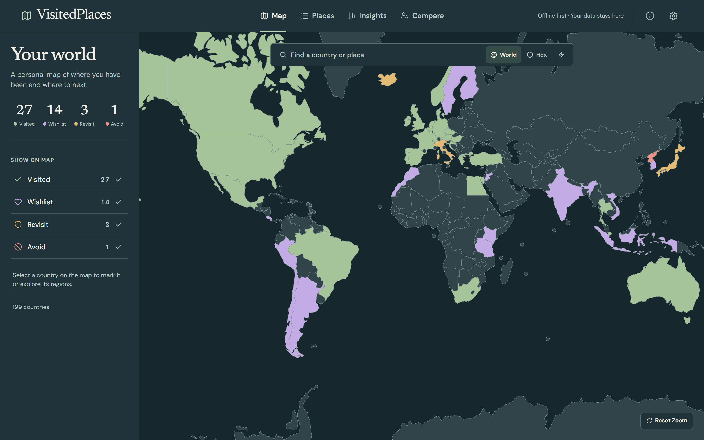

*The map with sample travel data. [See more screenshots](#see-it-in-action) · [Run locally](#run-it-locally) · [How your data works](#privacy-and-offline-use)*

## Start with your map

Choose **Visited**, **Wishlist**, **Revisit**, or **Avoid** for a country on the map or in the Places directory. Search for a place, filter the directory by continent or status, and open a country to mark its sub-regions. Marking a sub-region can also update its parent country status.

Your map is saved automatically in this browser. Open **Settings → Export your map** to copy a code for backup or sharing. Importing a code in Settings replaces the places currently saved on that device.

## See it in action

### 1. Find and mark places

The Places directory gives you quick status controls, search, filters, and a detail panel for supported sub-regions.

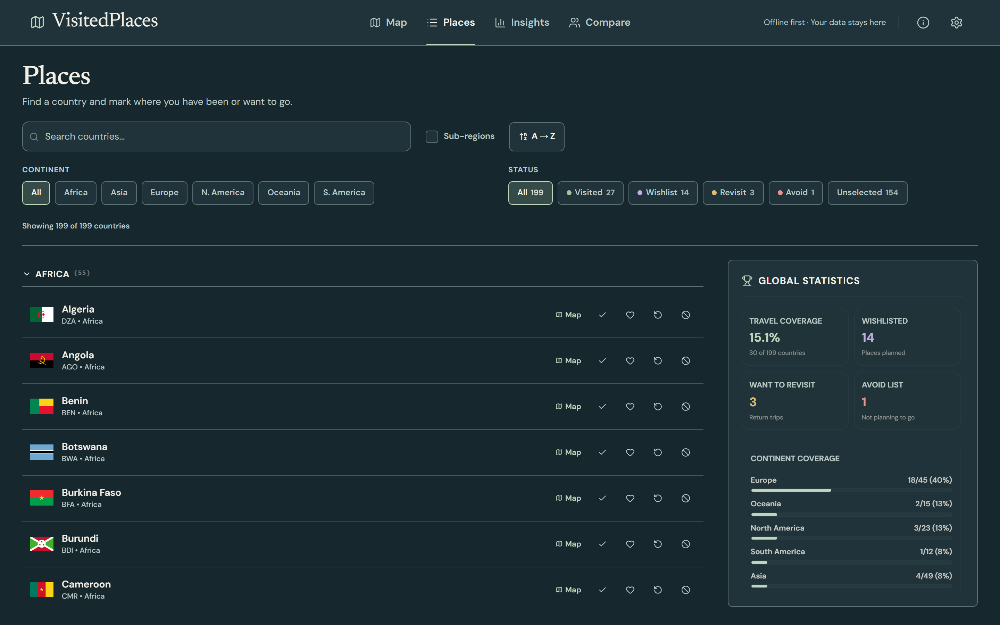

Open a country on the map to work at regional scale. The example below shows US states and a separate list of territories.

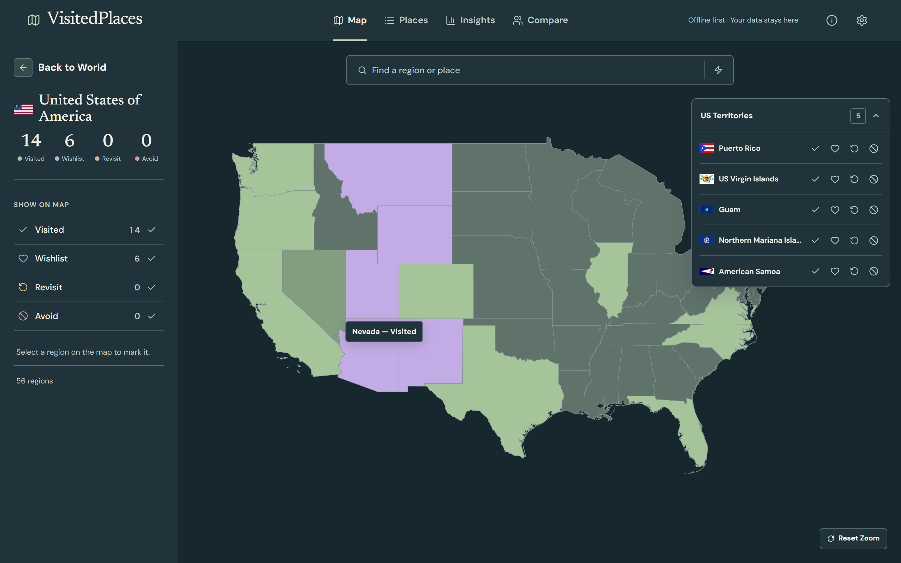

### 2. Understand your coverage

Insights turns your entries into continent coverage, regional breakdowns, and exploration milestones.

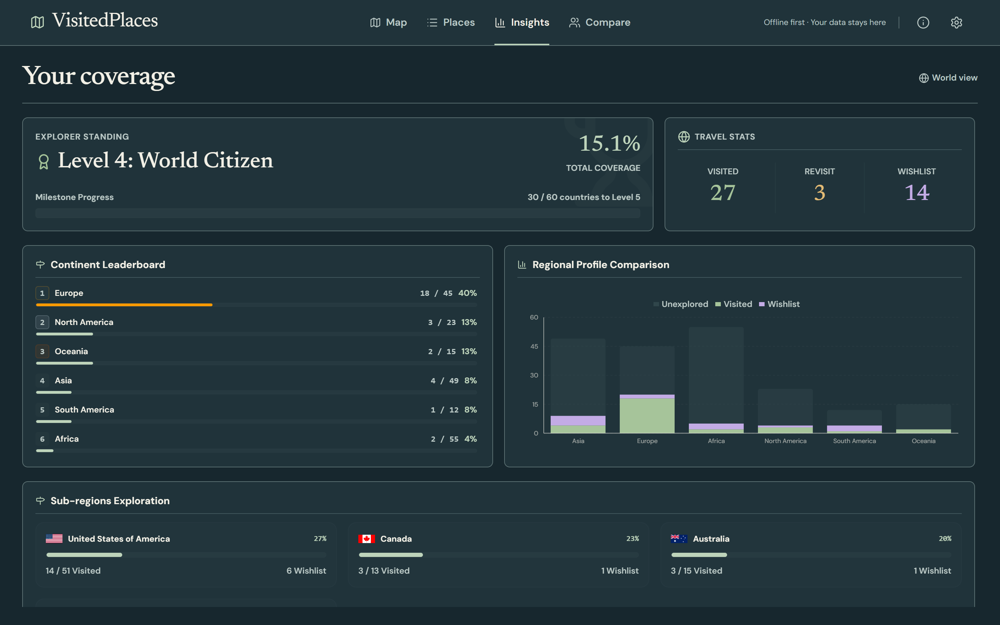

### 3. Compare with friends

Copy your code from Settings or the Compare page. Add a friend's code to a comparison group to see shared visits, different journeys, wishlists, and a compatibility score. Comparison groups are saved in this browser too.

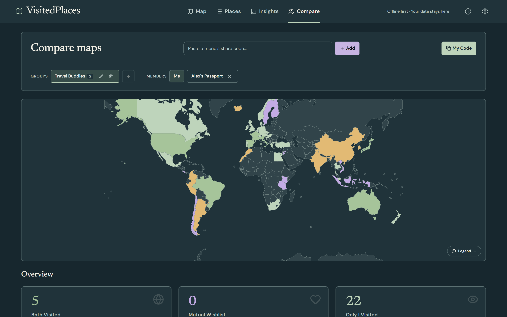

### On mobile

The same tracking, regional detail, insights, and comparison flows fit a phone screen. These captures use the light theme and the same sample travel data as the desktop images.

**Map and regional map**

<p>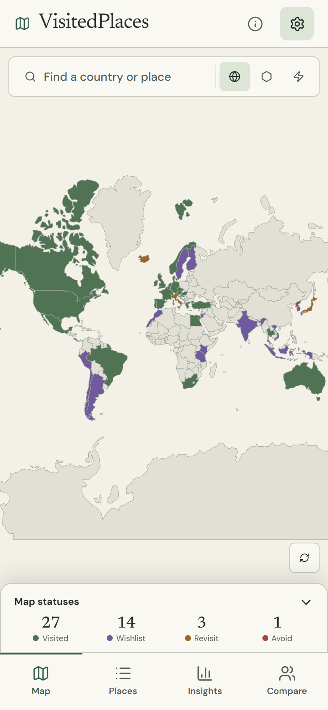 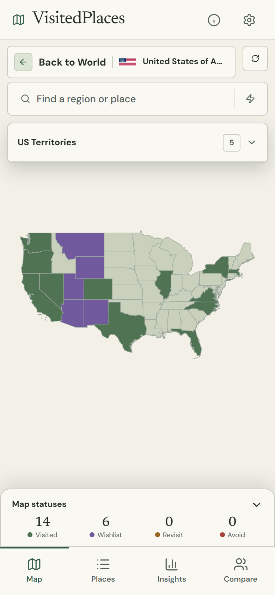</p>

**Places and sub-region detail**

<p>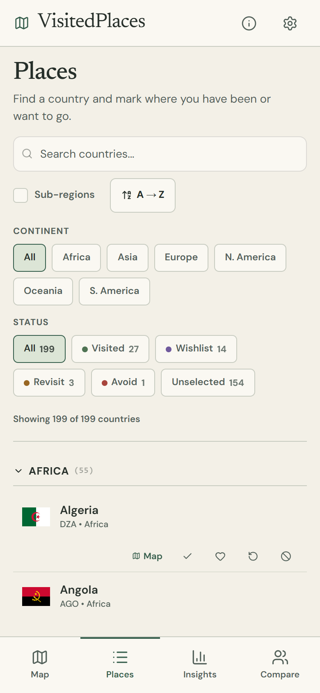 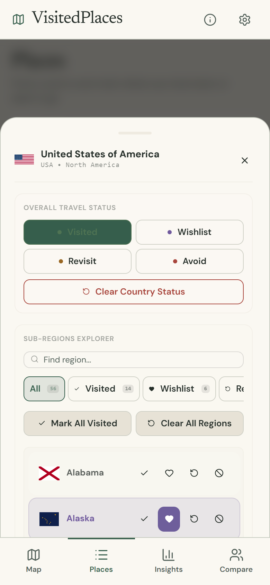</p>

**Insights and Compare**

<p>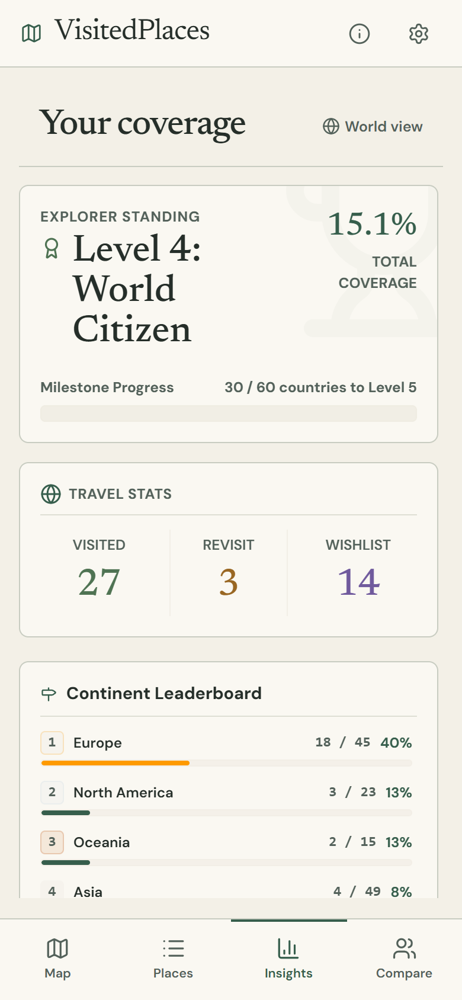 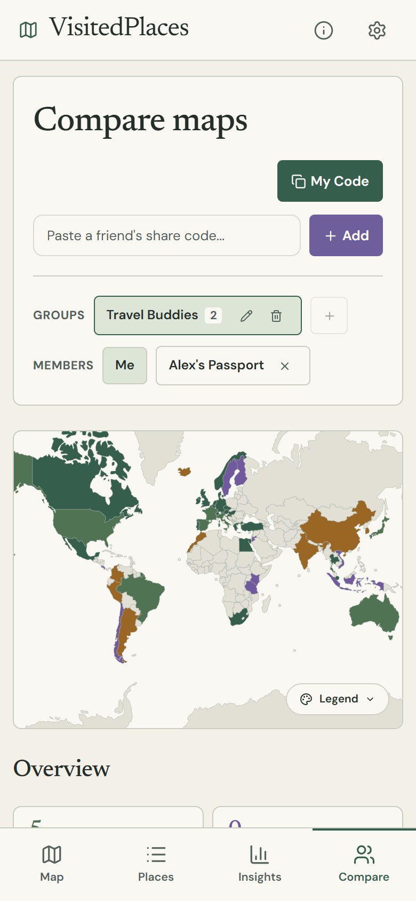</p>

<details>
<summary>More views: hex map and sub-region explorer</summary>

The hex map offers an alternative view of the same country statuses.

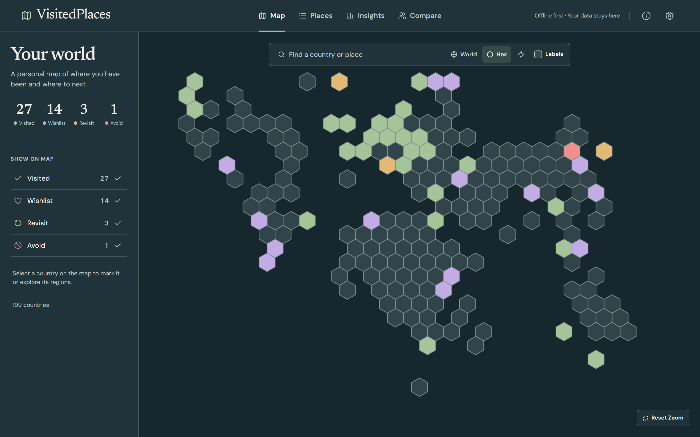

The Places detail panel lets you search and manage a country's regions.

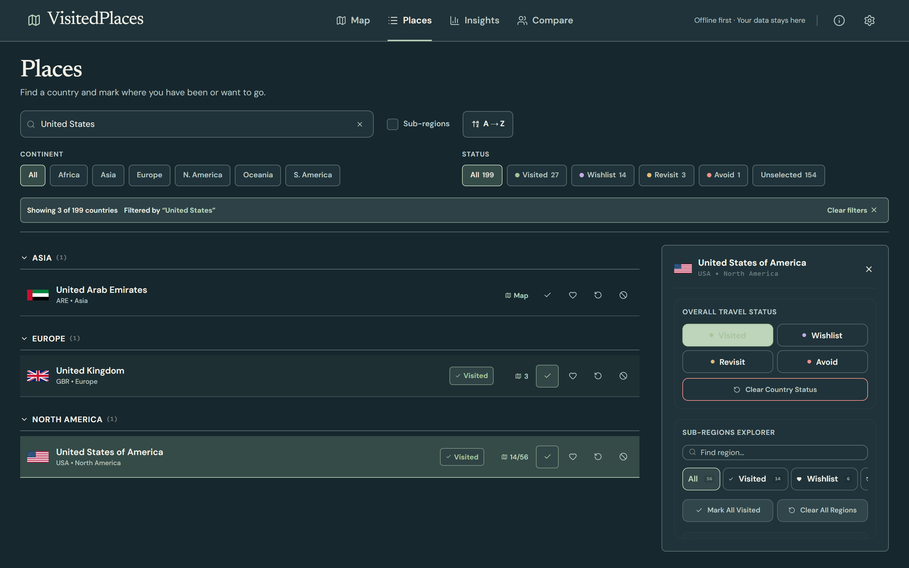

</details>

## Run it locally

Requires **Node.js 20+** and **npm 10+**.

```bash
git clone https://github.com/NotToxel/VisitedPlaces.git
cd VisitedPlaces
npm install
npm run dev
```

Open the local URL printed by Vite (normally `http://localhost:5173`). To build the static site:

```bash
npm run build
npm run preview
```

Deploy the generated `dist/` directory to a static host. The app does not need a backend or environment variables.

## Privacy and offline use

- **Your travel entries stay local.** Zustand persists them in `localStorage`. There are no accounts or application servers receiving your map. Share codes contain your places, so send them only to people you choose.
- **Country tracking uses bundled data.** Country metadata and world geometry ship with the app. Once the app assets are available, marking countries, viewing insights, and using share codes do not depend on a data API.
- **Some details need a connection.** Most sub-region maps load Natural Earth geometry on demand; the Singapore override and some flag images also use external sources. City and region-name search indexes load from this site's own files as needed. Search text is not sent to a geocoding service.
- **Browser storage belongs to this browser.** Clearing site data removes your saved map and comparison groups. Keep an exported code if you need a backup or want to move devices.

## For contributors

This is a React 19 and TypeScript app built with Vite 7. Zustand holds local state, React Router handles the pages, react-simple-maps and D3 render maps, and Recharts powers Insights. Styling combines CSS design tokens with Tailwind utilities. Read [AGENTS.MD](AGENTS.MD) for architecture, project conventions, and feature guides.

```bash
npm run lint        # ESLint
npm run test:run    # Vitest
npm run build       # TypeScript check and production build
npm run screenshots # Refresh README images while the dev server is running
```

The screenshot script seeds a **sample map** in a fresh browser context and writes images to [`docs/screenshots/`](docs/screenshots/). It does not use your personal browser data.

### Data and attribution

- World boundaries: [world-atlas](https://github.com/topojson/world-atlas), bundled as [`public/countries-110m.json`](public/countries-110m.json).
- Sub-region geometry: [Natural Earth admin-1](https://github.com/nvkelso/natural-earth-vector), fetched on demand for most countries; Singapore uses a [planning-area GeoJSON source](https://github.com/yinshanyang/singapore).
- Country metadata: bundled in [`src/data/countries.ts`](src/data/countries.ts), compiled from [REST Countries](https://restcountries.com/).
- Country flags: [FlagCDN](https://flagcdn.com/). Sub-national flags: [iso3166-flags](https://github.com/amckenna41/iso3166-flags).
- Place search: [GeoNames cities500](https://download.geonames.org/export/dump/) under CC BY 4.0. See [coverage and attribution notes](public/place-index/README.md).

## License

VisitedPlaces is licensed under [GNU AGPL v3.0 only](LICENSE).
